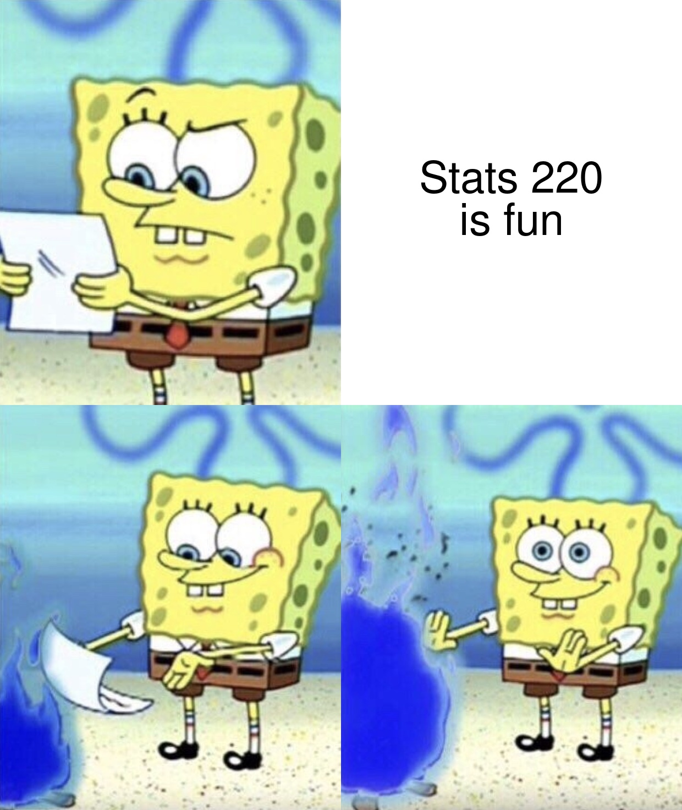
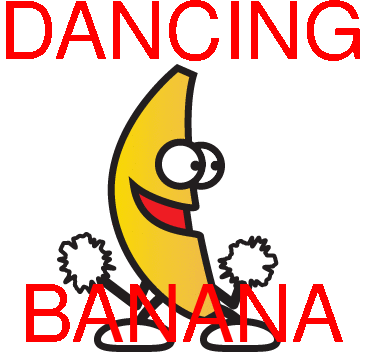

```{r setup, include=FALSE}
knitr::opts_chunk$set(echo = TRUE, message = FALSE)
```

```{css}
@import url('https://fonts.googleapis.com/css2?family=Dancing+Script:wght@700&family=Noticia+Text&family=Rampart+One&display=swap');
body {
  font-family: 'Noticia Text', serif;
  background-image: linear-gradient(#ADD8E6, white);
  border: solid;
  color: #00006b;
}
h1, h2, h3 {
  font-family: 'Rampart One', cursive;
  text-align: center;
}
h4 {
  font-family: 'Dancing Script', cursive;
  text-align: center;
}
.border {
  border: solid;
  border-color: #00006b;
}
```


## ⌁ My Meme ⌁
This four panel meme depicts SpongeBob SquarePants a popular cartoon character reading a letter with a puzzled look. He casts the letter into a fire showing his disapporval of the message on it. My meme is supposed to be a bit of banter but in reality I am really enjoying the course!

<center>
  
</center><br />

```{r file='meme.R', eval=FALSE}

```

## ⌁ My Animated GIF ⌁
The dancing banana GIF is a popular internet meme chracter! I have split the GIF frames and added text onto each one with disco colouring to make it more chaotic!

<center>
  
</center><br />


```{r file='animation.R', eval=FALSE}

```