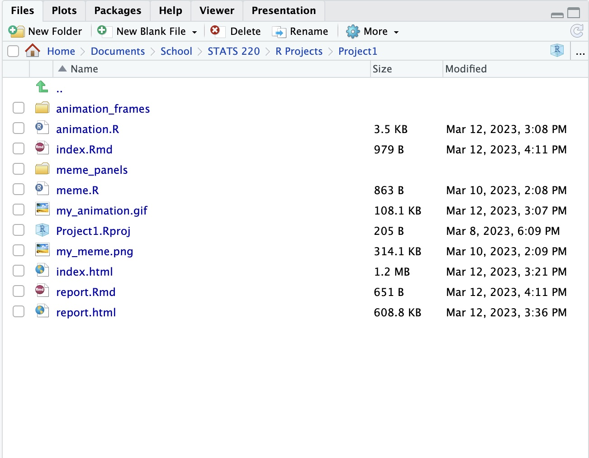

```{r setup, include=FALSE}
knitr::opts_chunk$set(echo = TRUE)
```

```{css}
@import url('https://fonts.googleapis.com/css2?family=Dancing+Script:wght@700&family=Noticia+Text&family=Rampart+One&display=swap');
body {
  font-family: 'Noticia Text', serif;
  background-image: linear-gradient(#ADD8E6, white);
  border: solid;
  color: #00006b;
}
h1, h2, h3 {
  font-family: 'Rampart One', cursive;
  text-align: center;
}
h4 {
  font-family: 'Dancing Script', cursive;
  text-align: center;
}
```

## ⌁ Project Requirements ⌁
My GitHub repo can be found [here](https://github.com/C26R/stats220),
and my website can be found [here](https://c26r.github.io/stats220/).

**GitHub requirements (I have met):**
- Repo is named stats220, and is public
- I have two levels of headers used (one first, two second level)
- I have an ordered list (capabilities), and one unordered one (project one)
- I have bold and italic texts
- I have links to the STATS 220 course outline and my project website

**Project folder screenshot:**


**Demonstrating creativity:**
...

## ⌁ Learning Reflection ⌁
One important idea that I have learnt in this project is the idea of combining multiple different programming languages, and tools together to create a final project. For this project I have used Markdown, R (with RStudio), CSS, and GitHub all in conjunction with each other and have learnt that you can combine multiple things together and use all of them for their strengths to get a better end product! What I am curious about is how many more different modern technologies are combined in conjunction with each other in a company job setting and just how much more complicated their systems get!