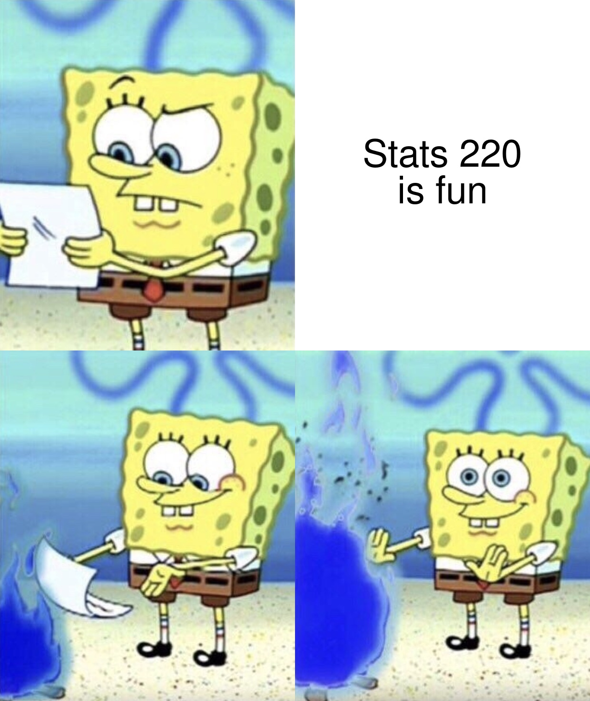
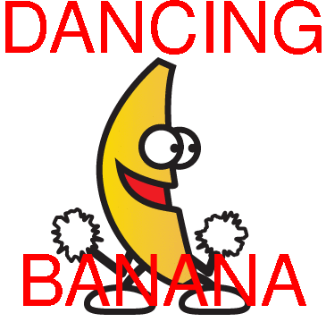

```{r setup, include=FALSE}
knitr::opts_chunk$set(echo = TRUE, message = FALSE)
```

```{css}
@import url('https://fonts.googleapis.com/css2?family=Sono&display=swap');
body {
  font-family: 'Sono', sans-serif;
  background-color: #ADD8E6;
}
```


## My meme
This four panel meme depicts SpongeBob SquarePants a popular cartoon character reading a letter with a puzzled look. He casts the letter into a fire showing his disapporval of the message on it. My meme is supposed to be a bit of banter but in reality I am really enjoying the course!



```{r file='meme.R', eval=FALSE}

```

## My animated GIF
The dancing banana GIF is a popular internet meme chracter! I have split the GIF frames and added text onto each one with disco colouring to make it more chaotic!


```{r file='animation.R', eval=FALSE}

```